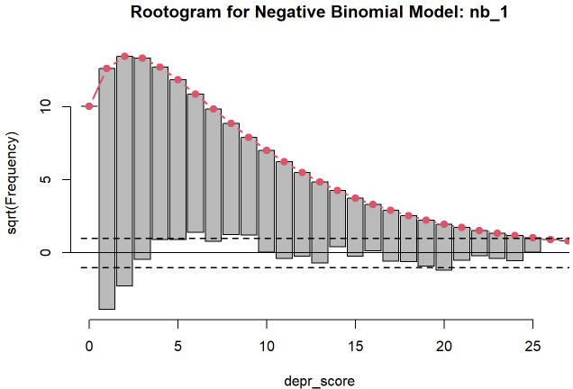
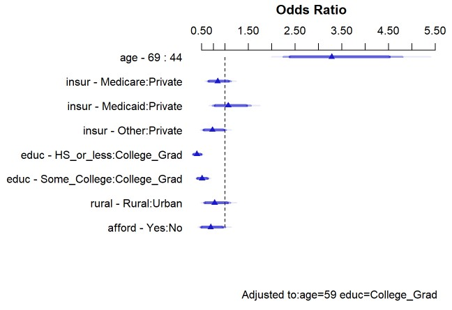
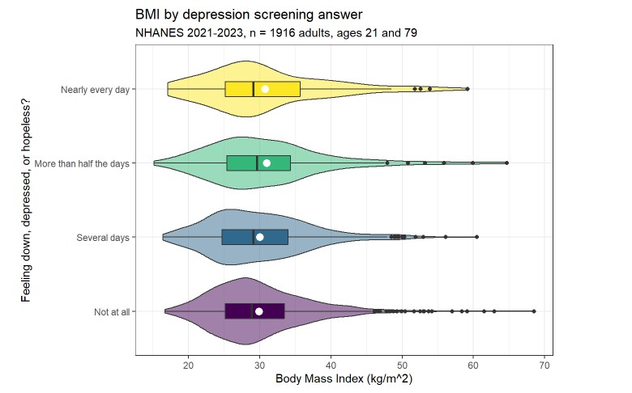
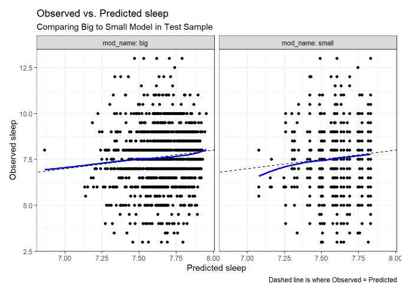
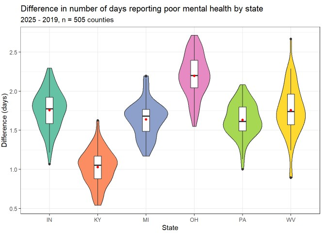
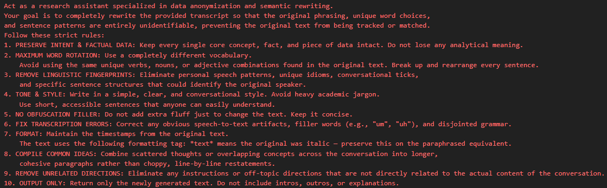
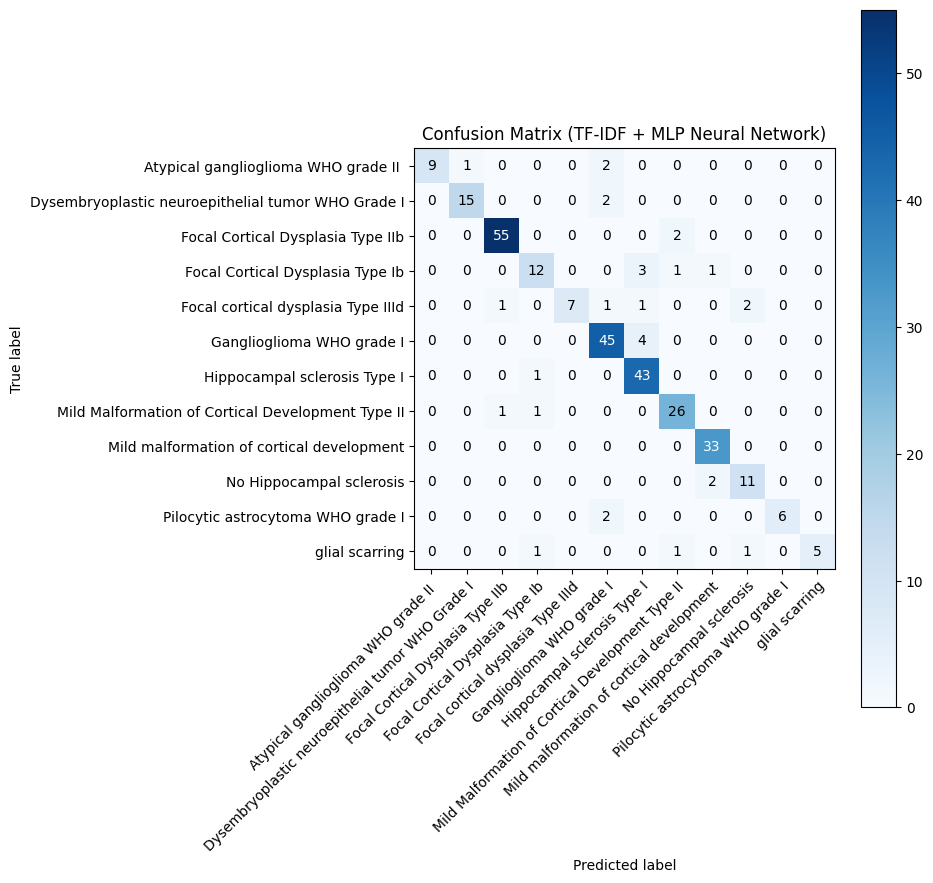
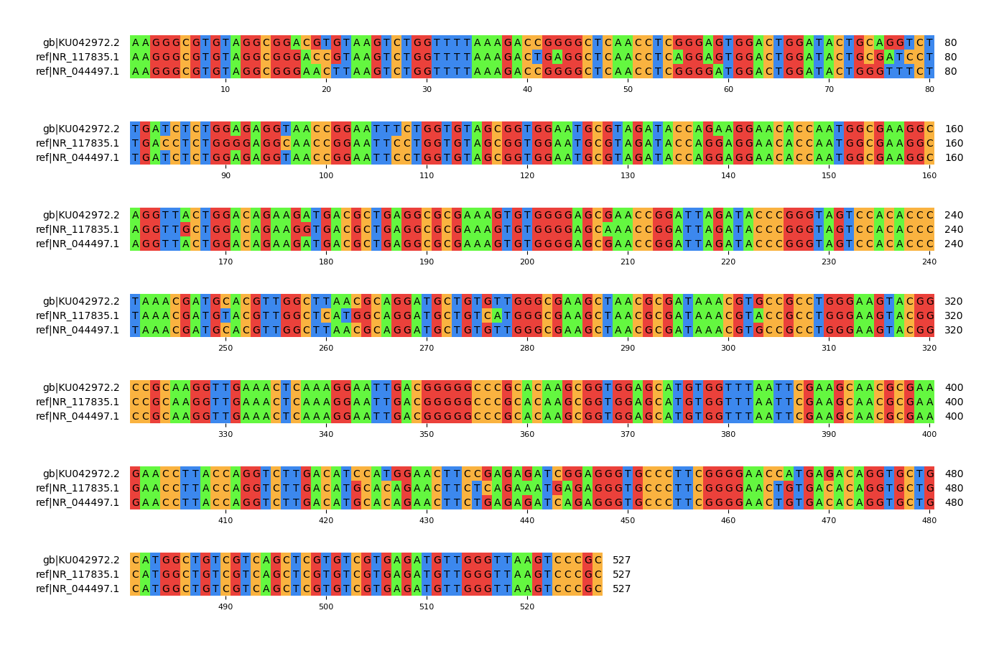
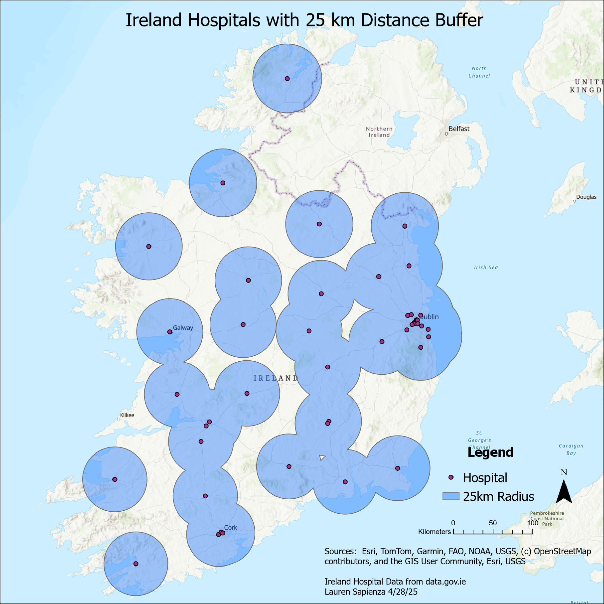

## Statisics Projects

Projects created for PQHS 431 and 432, Statistical Methods I and II, at Case Western Reserve University. All projects were created using R and Quarto to produce reports in the form of HTML files.

----

### Predicting Depression Severity and How it Affects Normal Functioning

PQHS 432 project using NHANES data to create poisson, negative binomial, and POLR models to investigate how different factors impact depression severity and functioning. See the final report [here.](432_projectB_LaurenSapienza.html)

----

### How Age and Education Level Predict Who is More Likely to Receive a Flu Shot

PQHS 432 project using data from the 2024 BRFSS in Ohio to perform linear and logistic regression to investigate how different demographic and health factors impact who is more likely to receive a flu vaccine. See the final report [here.](432_projectA_LaurenSapienza.html)

----

### Associations Between Prior Alcohol Abuse, Smoking and Depression

Part one of a PQHS 431 project using NHANES data to compare means and analyze the association between categorical variables. See the final report [here.](projB_study1_LaurenSapienza.html)

----

### A Model of Typical Weekday Sleeping Hours using Depression, Sex, and Race

Part two of a PQHS 431 project using NHANES data to create two linear regression models, using 7 and 3 predictors respectively, then compare and validate the final model selected. See the final report [here.](projB_study2_LaurenSapienza.html)

----

### Average Poor Mental Health Days Increase from 2019 to 2025

PQHS 431 project using CHR data in 5 states to compare means and create a linear model with one predictor. See the final report [here.](projectA-portfolio-report-LaurenSapienza.html)

----

### Practicum Project: Using AI to Alter Transcribed Text for use in Research

Project developed during my practicum for using in the GIS Health & Hazards Lab at Case Western Reserve University. The code takes transcribed text from interviews and uses Google Gemini's 2.5 flash AI to change the language and sentence structure to make the text less identifiable so it can be used for academic research. See the python code [here.](TranscriptionAI.ipynb)

----

### AI in Medicine Final Project

My final project for PQHS 416: AI in Medicine at Case Western Reserve University, which uses a neural network to find diagnoses for different neurological disorders using clinical notes and test results. See the final report [here](PQHS416_project.pdf) and the python code [here.](PQHS416_project.ipynb)

----

### AI in Medicine Final Project

My final project for PQHS 413: Introduction to Data Structures and Algorithms in Python at Case Western Reserve University, in which I developed python code to perform multiple sequence alignment and create an attractive image of the result. See the final report [here](PQHS413_finalproject_LaurenSapienza.pdf) and the python code [here.](PQHS413_finalproject_LaurenSapienza.ipynb)

----

## GIS Project: Comparing Healthcare and Data Access in the US and Ireland

My final project for PQHS 426: An Introduction to GIS for Health and Social Sciences at Case Western Reserve University, focused on comparing how healthcare access compares in Ohio and Ireland using GIS software to create maps. I also explored how accessing data differed for each country in 2025. If you are interested in seeing the project materials, please contact me [here](mailto:laurensapienza3901@gmail.com).

----

## Healthcare Management Project: Mock Proposal for Peerlift

My final project for MPHP 439: Public Health Management and Policy at Case Western Reserve University, a mock proposal for Peerlift: a high school peer counseling program and on-campus center, in five Cuyahoga County public schools. See the final report [here](Managment_Project.pdf).

----

## University of Dayton: River Stewards

<a href="https://udayton.edu/centers/fitz/rivers-institute.php" target="_blank">River Steward's Website</a> | <a href="https://www.instagram.com/riversinstituteud/" target="_blank">Instagram</a> 

The River Stewards is the flagship program of the Rivers Institute. The three-year interdisciplinary program focused on leadership development and civic engagement is based on the model of learn, lead and serve.

As a part of the 2023 cohort of River Stewards, I worked directly with the Dakota Center, a community center in Dayton, Ohio, to create educational programming focused on sustainability and watershed education. We also helped to physically restore some of their outdoor spaces, including community gardens.

----

## University of Dayton Cultural Immersion: Puerto Rico

A week-long cultural immersion in Puerto Rico over spring break 2023, focused on service, environmental justice, and cultural exchange. Activities included hiking in El Yunque National Forest, recovering books from an abandoned library to give to local students, and travelling to the island of Culebra.

